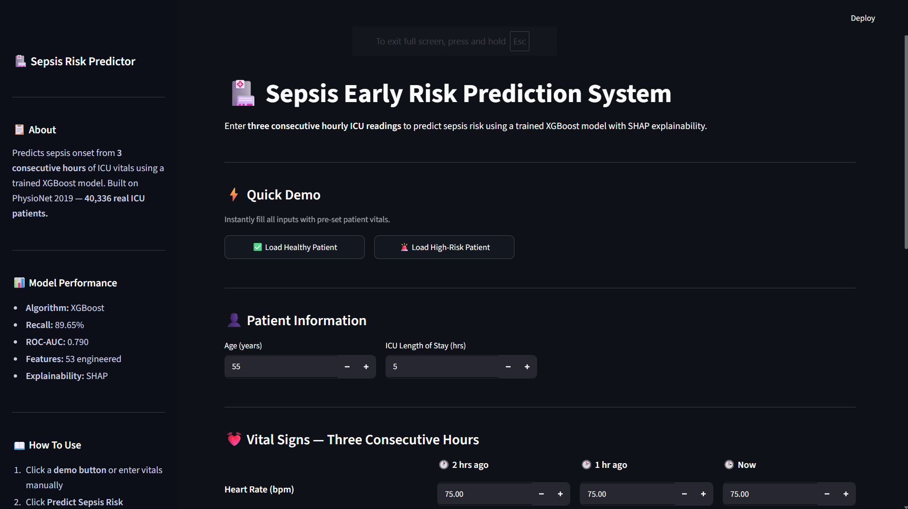
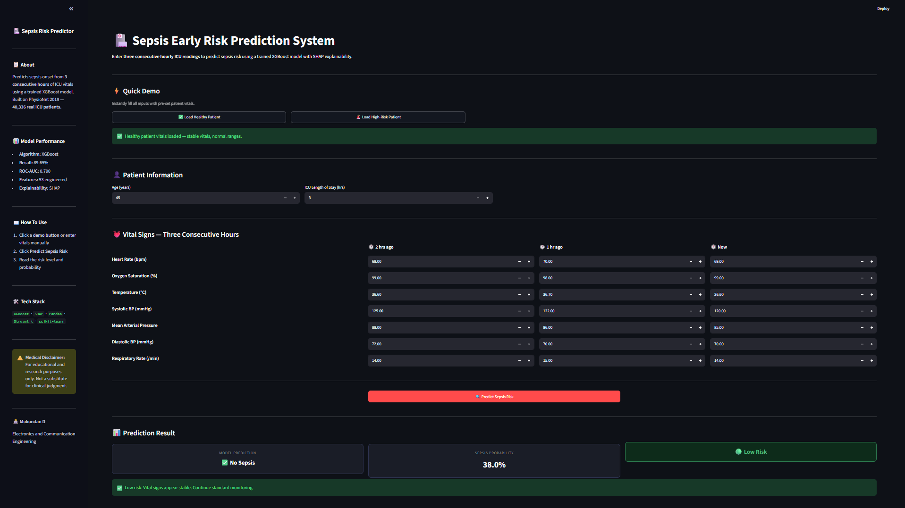
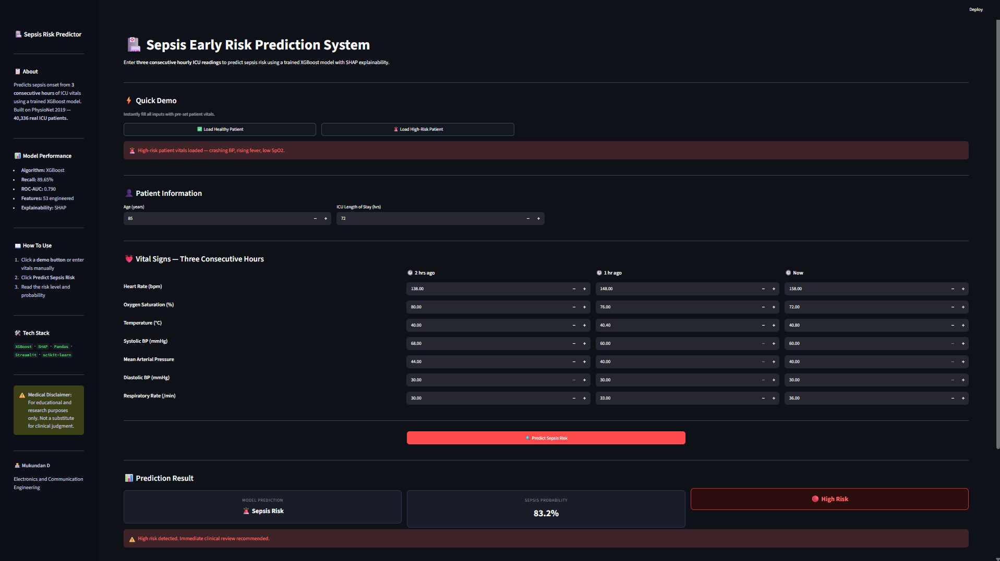
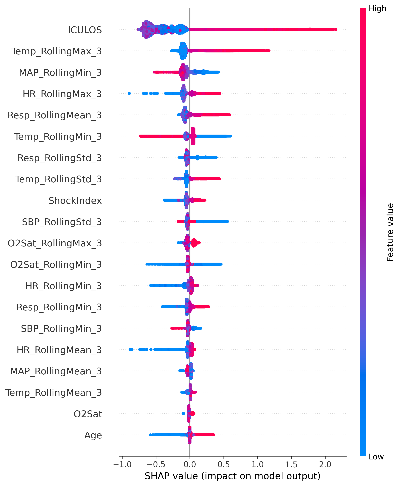
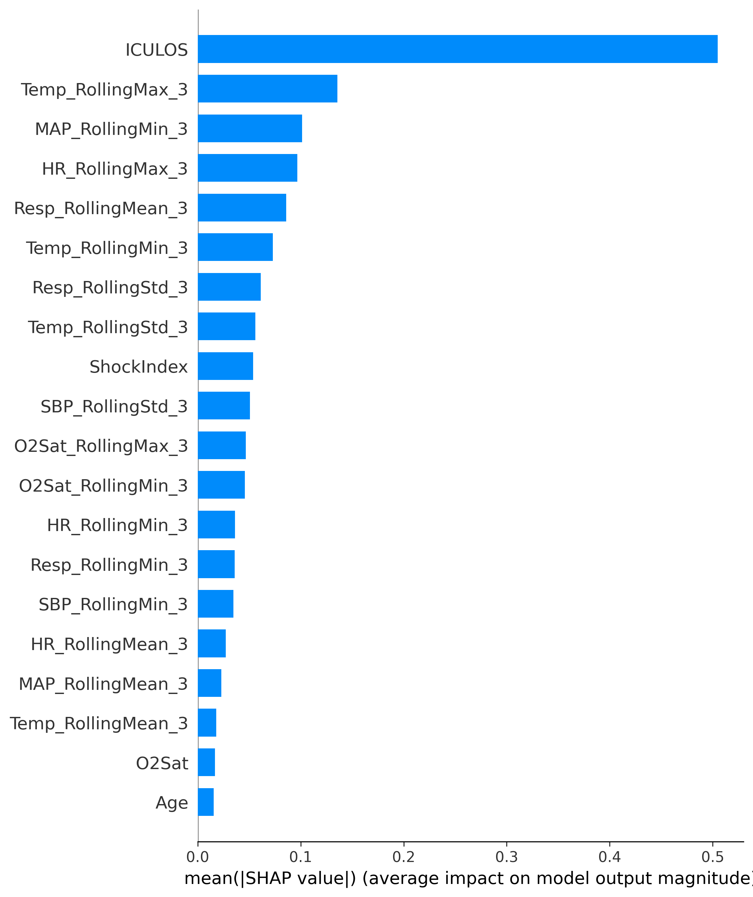

# 🏥 Sepsis Early Risk Prediction System

An end-to-end Machine Learning system for **early Sepsis risk prediction** using ICU patient vital signs. This project combines **time-series feature engineering**, **XGBoost**, **hyperparameter optimization**, **SHAP explainability**, and an interactive **Streamlit web application** to demonstrate how Machine Learning can assist clinicians in identifying high-risk patients before critical deterioration.

---

## ✨ Project Highlights

- 🚑 Early prediction of Sepsis using ICU patient data
- 🧠 XGBoost model with hyperparameter optimization
- 📈 53 engineered time-series features
- 🔍 SHAP Explainability for model interpretation
- 💻 Interactive Streamlit web application
- 📊 Patient-wise train/test split to prevent data leakage
- ⚡ Modular project structure with reusable backend code
- 🏥 Built using the PhysioNet 2019 Sepsis Challenge dataset

---

# 📸 Application Preview

## 🏠 Home Page



---

## ✅ Healthy Patient Prediction



---

## 🚨 High-Risk Patient Prediction



---

# 📌 Why this project?

Sepsis is one of the leading causes of death among Intensive Care Unit (ICU) patients. Delayed diagnosis can rapidly lead to organ failure and significantly reduce the chances of survival.

Traditional monitoring often relies on observing individual vital signs independently. This project instead analyzes **how a patient's vital signs change over time**, allowing the model to recognize patterns that may indicate early signs of Sepsis before obvious clinical deterioration occurs.

Rather than depending solely on the current measurement, the model learns from the patient's recent physiological history, making its predictions more informative and clinically relevant.

---

# 📥 Dataset

This project uses the **PhysioNet Challenge 2019 – Early Prediction of Sepsis from Clinical Data** dataset.

Due to GitHub's file size limitations, the dataset is **not included** in this repository.

You can download it directly from:

**PhysioNet 2019 Challenge**
https://physionet.org/content/challenge-2019/

After downloading, place the dataset inside the following directory:

```text
data/

├── raw/
│   └── Dataset.csv
│
└── processed/
```

Then run the preprocessing notebook to automatically generate the processed training and testing datasets.

---

# 🚀 Project Workflow

```text
Raw ICU Dataset
        │
        ▼
Data Cleaning
(SimpleImputer + GroupShuffleSplit)
        │
        ▼
Time-Series Feature Engineering
(53 Engineered Features)
        │
        ▼
Model Comparison
(Logistic Regression
Random Forest
XGBoost)
        │
        ▼
Hyperparameter Optimization
(RandomizedSearchCV)
        │
        ▼
SHAP Explainability
        │
        ▼
Interactive Streamlit Web Application
```

---
# 🛠 Data Preprocessing

Before training the model, the raw ICU data was cleaned and prepared to ensure reliable predictions.

The preprocessing pipeline included:

- Handling missing values using **SimpleImputer**
- Patient-wise train/test splitting using **GroupShuffleSplit** to prevent data leakage
- Sorting each patient's records chronologically
- Preparing the dataset for time-series feature engineering

Using a patient-wise split is important because multiple hourly records belong to the same patient. Without it, information from one patient could appear in both training and testing sets, leading to overly optimistic evaluation results.

---

# ⚙ Feature Engineering

A major objective of this project was to capture how a patient's condition changes over time instead of relying only on a single observation.

A total of **53 features** were used by the final model.

## Original Clinical Features

- Heart Rate (HR)
- Oxygen Saturation (O2Sat)
- Temperature
- Systolic Blood Pressure (SBP)
- Mean Arterial Pressure (MAP)
- Diastolic Blood Pressure (DBP)
- Respiratory Rate (Resp)
- Age
- ICU Length of Stay (ICULOS)

---

## Engineered Time-Series Features

For every vital sign, the following temporal features were created.

### Rolling Mean

Calculates the average of the previous three hourly readings.

Purpose:

- Smooths noisy measurements
- Captures short-term patient trends

---

### Rolling Standard Deviation

Measures how much a patient's readings fluctuate during the previous three hours.

Purpose:

- Detects instability
- High variation may indicate clinical deterioration

---

### Rolling Maximum

Stores the highest value observed during the previous three hours.

Purpose:

- Captures temporary spikes in vital signs

---

### Rolling Minimum

Stores the lowest value observed during the previous three hours.

Purpose:

- Captures sudden drops in patient condition

---

### Change Features

Difference between the current reading and the previous hour.

Purpose:

- Measures how rapidly the patient's condition is changing

---

### Lag Features

Stores the previous hour's measurement.

Purpose:

- Allows the model to compare current values with recent history

---

### Clinical Features

Two medically meaningful features were also engineered.

**Pulse Pressure**

Pulse Pressure = SBP − DBP

Measures the difference between systolic and diastolic blood pressure.

---

**Shock Index**

Shock Index = Heart Rate / SBP

A clinically important indicator often associated with circulatory instability and increased risk of sepsis.

---

# 🤖 Model Comparison

Three machine learning algorithms were evaluated on the engineered dataset.

| Model | Purpose |
|-------|---------|
| Logistic Regression | Baseline linear classifier |
| Random Forest | Ensemble tree model |
| XGBoost | Gradient boosting model |

Each model was evaluated using:

- Accuracy
- Precision
- Recall
- F1 Score
- ROC-AUC
- PR-AUC

Although Random Forest achieved competitive performance, **XGBoost consistently produced the highest ROC-AUC score**, making it the strongest overall classifier for this highly imbalanced medical dataset.

For that reason, XGBoost was selected as the final production model.

---

# 🚀 Model Optimization

The selected XGBoost model was further optimized using **RandomizedSearchCV**.

Instead of manually tuning parameters, RandomizedSearchCV explored multiple combinations to identify the configuration that provided the best balance between detecting Sepsis cases and minimizing unnecessary false alarms.

Several important parameters were optimized, including:

- Learning Rate
- Number of Trees
- Maximum Tree Depth
- Minimum Child Weight
- Gamma
- Subsample
- Column Sampling
- Scale Positive Weight

Special attention was given to **Scale Positive Weight**, which helps XGBoost handle the severe class imbalance present in the dataset by assigning greater importance to the minority Sepsis class during training.

The optimized model achieved significantly higher recall while maintaining strong discriminative performance.
# 📊 Final Model Performance

After hyperparameter optimization, the final XGBoost model achieved the following performance on the unseen test dataset.

| Metric | Score |
|---------|------:|
| Accuracy | **42.46%** |
| Precision | **2.57%** |
| Recall | **89.65%** |
| F1 Score | **4.99%** |
| ROC-AUC | **0.7903** |
| PR-AUC | **0.0976** |

---

## 📌 Why is the Accuracy Low?

At first glance, an accuracy of **42.46%** may appear poor. However, this dataset is **highly imbalanced**, with healthy patients greatly outnumbering Sepsis patients.

The primary objective of this project is **not to maximize overall accuracy**, but to **identify as many Sepsis patients as possible**.

Missing a patient with Sepsis (False Negative) is significantly more dangerous than incorrectly flagging a healthy patient (False Positive). Therefore, the model was intentionally optimized to achieve a **very high Recall (89.65%)**, even if it resulted in lower overall accuracy.

This trade-off is common in medical diagnosis systems where patient safety is the highest priority.

---
---

## ⚠️ Known Limitations

**PR-AUC in context**
A PR-AUC of 0.0976 may look low in isolation, but with only ~1.8% Sepsis
prevalence in this dataset, a random classifier would score around 0.018
PR-AUC. This model performs roughly **5x better than random baseline**,
which is the more meaningful comparison for severely imbalanced clinical data.

**First-hour missing history**
For a patient's first recorded hour, Lag and Change features have no prior
reading to reference. These are currently filled with 0 as a simplification.
This means "no prior data" and "genuinely no change" are represented
identically, which could reduce sensitivity in early ICU hours — exactly
when early detection matters most. A future improvement would be to add
an explicit `is_first_hour` flag or u"A future improvement would be to add an explicit is_first_hour feature or explore more advanced temporal imputation techniques."

---

# 🔍 Model Explainability using SHAP

Machine learning models are often considered "black boxes" because they provide predictions without explaining their reasoning.

To improve transparency, this project uses **SHAP (SHapley Additive exPlanations)**.

SHAP helps answer important questions such as:

- Which features contributed the most to a prediction?
- Which features increased the patient's Sepsis risk?
- Which features reduced the predicted risk?
- How important is each feature overall?

Using SHAP makes the model easier to interpret and helps build trust in its predictions.

---
## SHAP Summary Plot

The figure below shows how each feature influences the model's predictions across the test dataset.



---

## SHAP Feature Importance

The mean absolute SHAP values highlight the overall importance of each feature.



---

# 💻 Streamlit Web Application

The trained model was deployed using **Streamlit** to create an interactive and user-friendly web application.

### Application Features

- Interactive medical dashboard
- Three-hour patient history input
- Automatic time-series feature engineering
- Real-time Sepsis risk prediction
- Probability-based risk estimation
- Built-in Healthy Patient and High-Risk Patient demo buttons for quick testing
- Low / Medium / High risk classification
- Medical disclaimer
- Clean and responsive user interface

The application automatically performs the same feature engineering pipeline used during model training before generating predictions.

---

# 📂 Project Structure

```text
Sepsis-Early-Risk-Prediction/

│
├── app.py
├── README.md
├── requirements.txt
│
├── models/
│   └── final_sepsis_model.pkl
│
├── notebooks/
│   ├── 01_Data_Preprocessing.ipynb
│   ├── 02_Model_Comparison.ipynb
│   ├── 03_Model_Optimization.ipynb
│   └── 04_SHAP_Explainability.ipynb
│
├── src/
│   ├── feature_engineering.py
│   ├── predict.py
│   └── evaluate.py
│
screenshots/
├── homepage.png
├── healthypatient.png
├── riskpatient.png
├── shap_summary.png
└── shap_bar.png
│
└── data/
    ├── raw/
    └── processed/
```

---

# 🛠 Technologies Used

- Python
- Pandas
- NumPy
- Scikit-learn
- XGBoost
- SHAP
- Streamlit
- Joblib
- Matplotlib

---

# 🔮 Future Improvements

Some possible future enhancements include:

- Integration with real-time ICU monitoring systems
- Deployment on cloud platforms such as AWS or Azure
- Deep Learning models for sequential patient data
- LSTM or Transformer-based time-series prediction
- Live SHAP visualizations within the Streamlit application
- Integration with hospital Electronic Health Record (EHR) systems

---
# 🚀 Installation

Clone the repository

```bash
git clone https://github.com/mukundan1012-creator/Sepsis-Early-Risk-Prediction.git
```

Navigate to the project directory

```bash
cd Sepsis-Early-Risk-Prediction
```

Install the required dependencies

```bash
pip install -r requirements.txt
```

---

# ▶️ Running the Application

Launch the Streamlit application by running:

```bash
streamlit run app.py
```

Once the application starts, open the local URL displayed in your terminal (typically `http://localhost:8501`) to access the dashboard.

---

# 🧪 Using the Application

1. Enter the patient's **Age** and **ICU Length of Stay (ICULOS)**.
2. Provide **three consecutive hourly readings** for the following vital signs:
   - Heart Rate (HR)
   - Oxygen Saturation (O2Sat)
   - Temperature
   - Systolic Blood Pressure (SBP)
   - Mean Arterial Pressure (MAP)
   - Diastolic Blood Pressure (DBP)
   - Respiratory Rate (Resp)
3. Click **Predict Sepsis Risk** to generate the prediction.
4. The application will automatically perform feature engineering and display:
   - Predicted Class (Healthy / Sepsis)
   - Sepsis Probability
   - Risk Level (Low / Medium / High)

For quick demonstrations, the application also includes **Healthy Patient** and **High-Risk Patient** sample inputs.

---

# 📌 Repository Overview

This repository demonstrates the complete lifecycle of a Machine Learning project:

- Data preprocessing
- Time-series feature engineering
- Model comparison
- Hyperparameter optimization
- Model explainability using SHAP
- Deployment using Streamlit

The project was developed with an emphasis on **clean code**, **modular design**, and **real-world deployment practices**.

---

# ⚠️ Medical Disclaimer

This project was developed for **educational and research purposes only**.

The predictions generated by this application should **not** be used as a substitute for professional medical diagnosis, treatment, or clinical decision-making.

Always consult qualified healthcare professionals when making medical decisions.

---

# 👨‍💻 Author

## Mukundan D

Electronics and Communication Engineering Undergraduate

Passionate about Embedded Systems, TinyML, Edge AI, Machine Learning, and VLSI Design.

### Areas of Interest

- Embedded Systems
- TinyML
- Edge AI
- Machine Learning
- Computer Vision
- VLSI Design

---

## 📬 Connect

If you have any suggestions, feedback, or would like to discuss this project, feel free to connect through GitHub.

GitHub Profile:

https://github.com/mukundan1012-creator

---

# ⭐ Support

If you found this project helpful or interesting, please consider giving the repository a **⭐ Star**.

It helps others discover the project and motivates further development.

---

## 🙏 Acknowledgements

- **PhysioNet Challenge 2019** for providing the ICU Sepsis dataset.
- The **XGBoost** development team.
- The **SHAP** library for model interpretability.
- The **Streamlit** team for making ML deployment simple and interactive.

---

**Thank you for visiting this repository!**